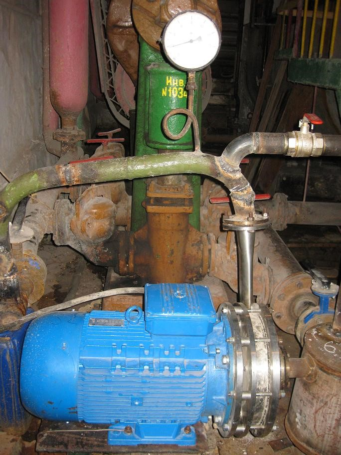

# РОТОРНО-ПУЛЬСАЦИОННЫЙ СТРУКТУРИЗАТОР
Роторно-пульсационный структуризатор предназначен для изменения физико-химических свойств текучих однородных жидкостей и суспензий. Многоступенчатое вращающееся устройство создает знакопеременные пульсации в рабочей зоне и структурирует среду. 

Высокая амплитуда (от вакуума до 1000&nbsp;кГс/см2), малый зазор (0,5÷2&nbsp;мм), большая окружная скорость (40÷50&nbsp;м/сек) создают условия для разрыва межмолекулярных связей жидкостей и изменяют физико-химические свойства обрабатываемой среды.  
Структуризатор нагревает среду на мощность, которая эквивалентна затрачиваемой электродвигателем на перемешивание.
## Применение
- Ускорение химических реакций и процессов абсорбции.
- Разрушение нежелательных органических примесей.
- Дегазация и стерилизация растворов.
- Диспергирование зерновых продуктов с увеличением выхода спирта на 10-15&nbsp;% в спиртовом производстве.
- Повышение степени переработки нефти и газовых конденсатов, а также очистки их от серы и других примесей.
- Получение стойких в течение длительного времени высокодисперсных эмульсий и паст:
  - Фармацевтические и биопрепараты.
  - Зубные пасты.
  - Детское питание.
  - Молоко.
  - Майонез.
  - Маргарин.
  - Соки с мякотью.
  - Кетчупы.
  - Лаки и краски.
  - Гидротопливо.
  - Смазочно-охлаждающие жидкости.
  - Антикоррозионные и тампонажных смеси.
- Производство стройматериалов – для приготовления цементных растворов, дорожных эмульсий.

Установка проста в управлении, надежна в эксплуатации и отвечает нормам эргономики и безопасности. Аппарат может быть изготовлен из коррозионно-стойких материалов.

## Технические данные и характеристики
| <!-- -->    | <!-- -->    |
| :---        |        ---: |
|Производительность при вязкости эмульсий 1.10-3&nbsp;–&nbsp;5.10-3 Па.с (водные растворы)|12-15&nbsp;м3/ч|  
|Производительность при вязкости эмульсий 2.10-1&nbsp;–&nbsp;5.10-1 Па.с (майонезы, краски)|8-10&nbsp;м3/ч|
|Напряжение электропитания|380/220&nbsp;В|
|Установленная мощность|30&nbsp;кВт|
|Класс защиты по ГОСТ&nbsp;12.2.025-76|1&nbsp;РОО|
|Гарантийный срок службы, не менее|1&nbsp;год|
|Габариты|800&nbsp;х&nbsp;430&nbsp;х&nbsp;470&nbsp;мм|
|Масса, не более|250–300&nbsp;кг|

